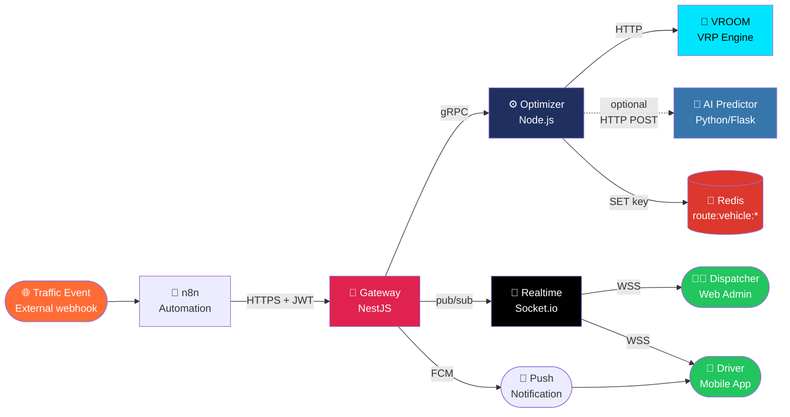
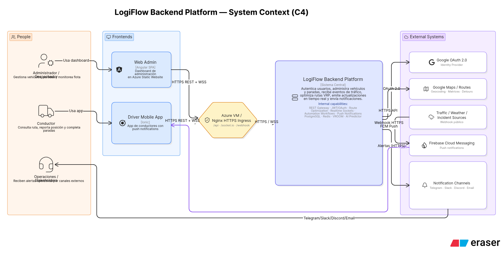
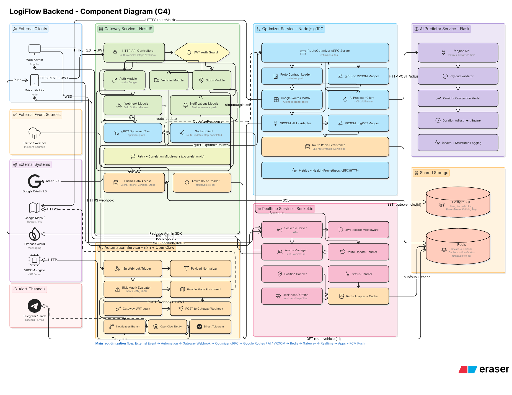
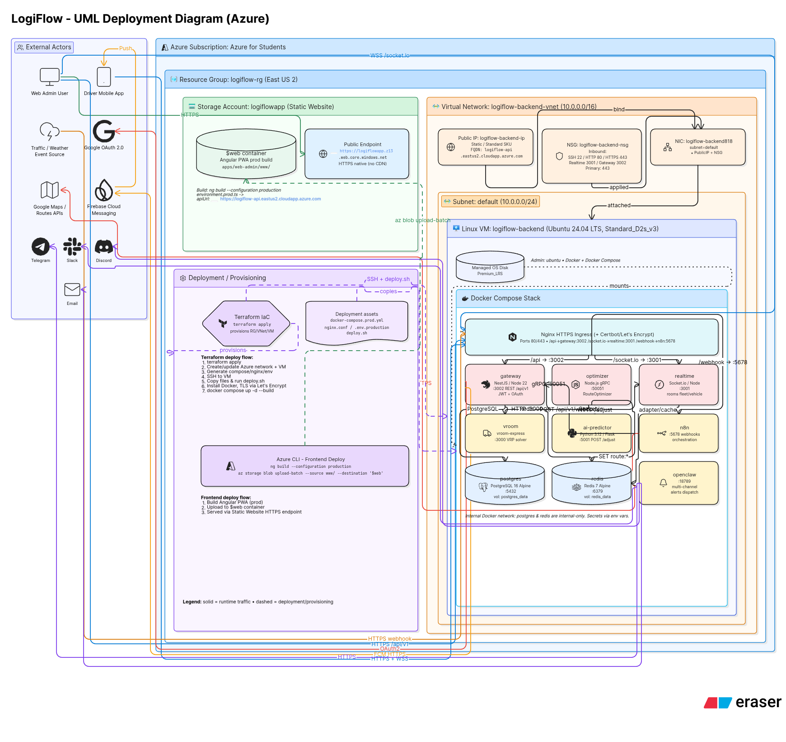
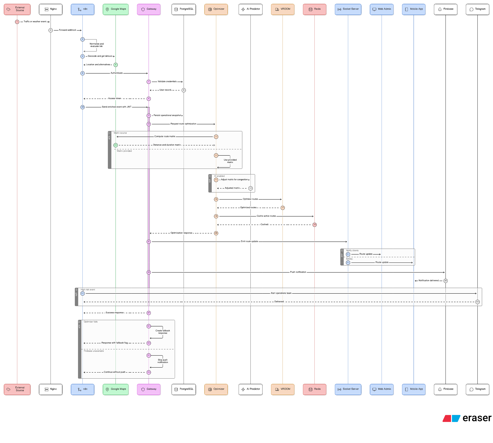
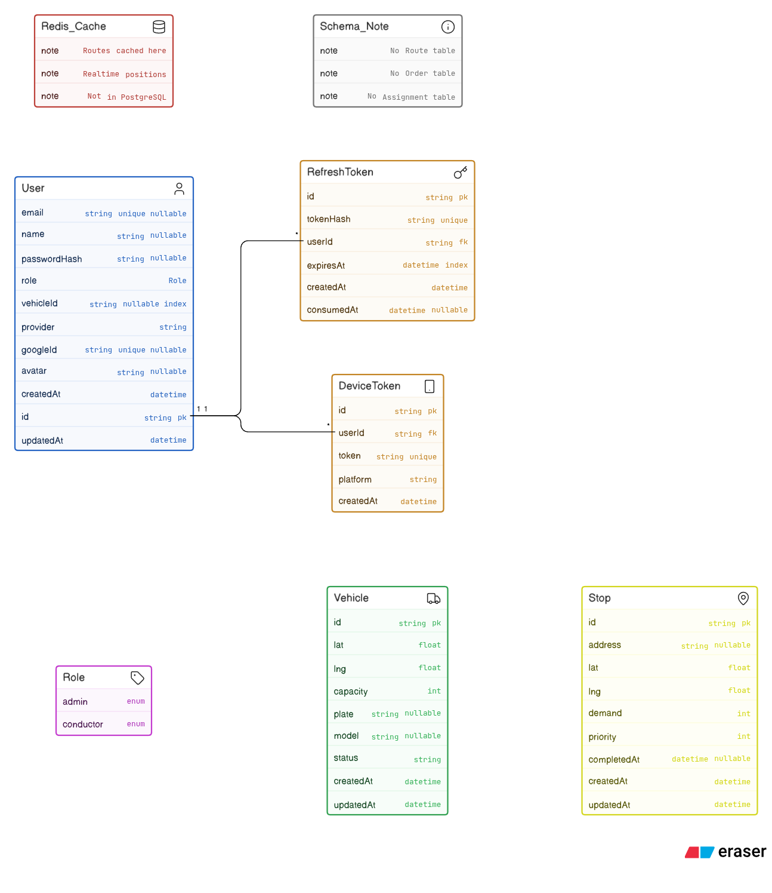
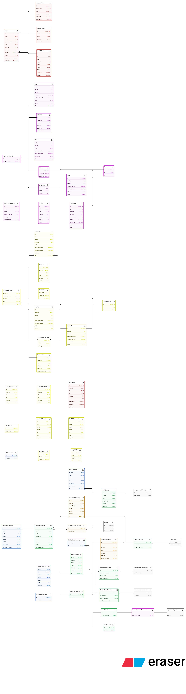
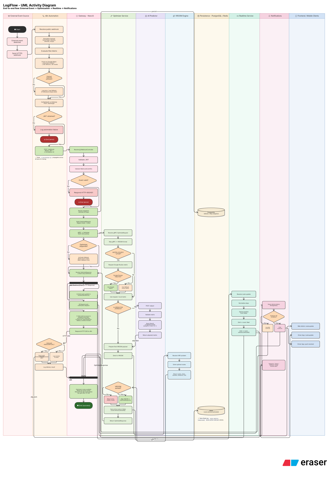

<!-- =================================================================== -->
<!--                            HERO SECTION                              -->
<!-- =================================================================== -->
<div align="center">

<a href="https://logiflowapp.z13.web.core.windows.net">
  
</a>

# LogiFlow — Backend Monorepo

### *Real-time dynamic fleet routing platform · cloud-native · 9 microservices · 245 story points*

<p>
  <a href="https://logiflowapp.z13.web.core.windows.net">
    
  </a>
  <a href="https://logiflow-api.eastus2.cloudapp.azure.com/api/v1/docs">
    
  </a>
  <a href="docs/LogiFlow-architecture.pdf">
    
  </a>
  <a href="docs/LogiFlow-article.pdf">
    
  </a>
</p>

<p>
  <a href="https://github.com/Logiflow-Gavilanes-ECI/logiflow/actions/workflows/ci.yml">
    
  </a>
  <a href="https://github.com/Logiflow-Gavilanes-ECI/logiflow/actions/workflows/deploy-backend.yml">
    
  </a>
  
  
  
  
</p>

<p>
  
  
  
  
  
  
  
  
  
  
  
  
</p>

</div>

---

<!-- =================================================================== -->
<!--                          AT-A-GLANCE PANEL                           -->
<!-- =================================================================== -->

<table>
<tr>
<td width="50%" valign="top">

### What is this?

**LogiFlow** is a distributed cloud-native platform that solves the **Vehicle Routing Problem (VRP) in under 4 seconds** when traffic events disrupt the day. Dispatchers see vehicles on a live map; drivers receive optimized routes on their Android app the instant a route closes or a new order arrives.

Built by **four engineering students** across **10 sprints** with **245 story points** delivered. Currently running on Azure with full Terraform-managed infrastructure.

</td>
<td width="50%" valign="top">

### Key metrics (production)

| Metric | Value |
|:---|---:|
| Latency P95 (50 users) | **2.81 s** |
| Throughput sostenible | **20.98 TPS** |
| Infrastructure uptime | **99.79 %** |
| End-to-end test coverage | **83.36 %** |
| Total story points | **245** |
| Sprints delivered | **10** |
| Microservices | **9** |
| LOC to migrate to another cloud | **0** |

</td>
</tr>
</table>

---

<!-- =================================================================== -->
<!--                       ARCHITECTURE FLOW                              -->
<!-- =================================================================== -->

## End-to-End Flow



<div align="center">
  <em>From traffic event detection to route delivered to the driver, in under 4 seconds.</em>
</div>

<details>
<summary><b>📐 Click for full architectural diagrams (Context, Components, Deployment, Sequence, ER, Class, Activity)</b></summary>

<br/>

### 🎯 Context Diagram (C4 Level 1)

<p align="center">
  
</p>

### 🧩 Components Diagram (C4 Level 2–3)

<p align="center">
  
</p>

### ☁️ Deployment Diagram

<p align="center">
  
</p>

### 🔄 Sequence Diagram — Reoptimization flow

<p align="center">
  
</p>

### 🗃️ Entity-Relationship Diagram

<p align="center">
  
</p>

### 📦 Class Diagram

<p align="center">
  
</p>

### ⚡ Activity Diagram

<p align="center">
  
</p>

</details>

---

<!-- =================================================================== -->
<!--                            NAVIGATION                                -->
<!-- =================================================================== -->

## Navigation

<table>
<tr>
<td align="center" width="20%">
  <a href="#services-overview"><b>🏗️ Services</b></a><br/>
  <sub>9 microservices, ports & roles</sub>
</td>
<td align="center" width="20%">
  <a href="#quick-start"><b>🚀 Quick Start</b></a><br/>
  <sub>Run the stack in 3 commands</sub>
</td>
<td align="center" width="20%">
  <a href="#environment-variables"><b>🔧 Environment</b></a><br/>
  <sub>All env vars documented</sub>
</td>
<td align="center" width="20%">
  <a href="#cicd"><b>🤖 CI/CD</b></a><br/>
  <sub>Pipelines and deployment</sub>
</td>
<td align="center" width="20%">
  <a href="#documentation"><b>📚 Documentation</b></a><br/>
  <sub>PDFs, slides, runbooks</sub>
</td>
</tr>
</table>

---

<!-- =================================================================== -->
<!--                        SERVICES OVERVIEW                             -->
<!-- =================================================================== -->

## Services Overview

<div align="center">

| Service | Tech | Port | Role |
|:---:|:---|:---:|:---|
| **🚪 gateway** | NestJS 11 · Prisma 7 · PostgreSQL | `3002` | REST API · Google OAuth · JWT · webhooks · FCM |
| **📡 realtime** | Node.js · Socket.io 4 · Redis Adapter | `3001` | WebSocket server · live fleet tracking |
| **⚙️ optimizer** | Node.js · gRPC · VROOM · Redis | `50051` | VRP route optimization (gRPC) |
| **🤖 ai-predictor** | Python 3.12 · Flask 3.1 · gunicorn | `5001` | Traffic-aware travel time adjustments |
| **🧭 vroom** | C++ VRP engine | `3000` | Internal · called by optimizer |
| **🗄️ postgres** | PostgreSQL 16 | `5432` | Users · vehicles · stops · routes |
| **💾 redis** | Redis 7 | `6379` | Pub/sub · Socket.io adapter · route cache |
| **🔧 n8n** | n8n 1.66.0 | `5678` | Workflow automation · webhook ingest |
| **🔔 openclaw** | OpenClaw 2026.5.12 · Claude Sonnet 4 | `18789` | AI-powered multi-channel notifications |

</div>

<details>
<summary><b>🚪 Gateway — REST API · Auth · Orchestration</b></summary>

<br/>

NestJS REST API and single public entry point for all clients.

**Responsibilities**
- Google OAuth 2.0 — sole authentication method (no email/password in production)
- JWT access tokens (1h) + rotated refresh tokens (7-day TTL, stored as SHA-256 hash)
- Role-based access: `admin` (dispatchers) and `conductor` (drivers)
- Receives traffic webhooks, calls the optimizer over gRPC, broadcasts results via Socket.io, sends FCM push notifications
- Vehicle and stop CRUD (admin only)

**Notable endpoints**

| Method | Path | Auth | Description |
|---|---|---|---|
| `GET` | `/api/v1/health` | Public | Health check |
| `GET` | `/api/v1/auth/google` | Public | Initiate Google OAuth (`?app=admin\|mobile\|web`) |
| `GET` | `/api/v1/auth/google/callback` | Public | OAuth redirect handler |
| `POST` | `/api/v1/auth/google/token` | Public | Exchange Google ID token (mobile) |
| `POST` | `/api/v1/auth/refresh` | Public | Rotate refresh token |
| `POST` | `/api/v1/webhook` | JWT (admin) | Receive traffic event, trigger optimization |
| `GET/POST/PATCH/DELETE` | `/api/v1/vehicles` | JWT | Fleet management |
| `GET/POST/PATCH/DELETE` | `/api/v1/stops` | JWT | Stop management |
| `POST` | `/api/v1/notifications/register-device` | JWT (conductor) | Register FCM device token |
| `GET` | `/api/v1/docs` | Public | Swagger UI |

</details>

<details>
<summary><b>⚙️ Optimizer — gRPC VRP solver with AI travel-time adjustment</b></summary>

<br/>

gRPC server that takes a Vehicle Routing Problem (VRP) payload, optionally adjusts travel times with the AI Predictor, calls VROOM, and persists route summaries to Redis.

**Environment flags**

| Variable | Dev default | Description |
|---|---|---|
| `MATRIX_SOURCE` | `request` | `request` = use matrix from payload; `google` = call Google Routes API |
| `GOOGLE_ROUTES_ALLOW_CALLS` | `false` | Gate for live Google Routes API calls |
| `GOOGLE_ROUTES_MOCK` | `true` | Return mock matrix instead of real API |
| `AI_PREDICTOR_ENABLED` | `false` | Toggle AI travel-time adjustments |
| `REDIS_ROUTE_TTL_SECONDS` | `3600` | Route cache TTL in Redis |

**Prometheus metrics (port 9090 in production)**

`optimize_requests_total` · `optimize_duration_ms` · `vroom_failures_total` · `ai_predictor_failures_total` · `ai_breaker_state_changes` · `redis_failures_total` · `matrix_source_total`

**AI circuit breaker (opossum):** 50% error threshold · 30s reset · min 5 volume.

</details>

<details>
<summary><b>📡 Realtime — Socket.io server with Redis pub/sub</b></summary>

<br/>

Socket.io server with Redis pub/sub adapter for multi-instance support.

**Rooms**

| Room | Clients | Events received |
|---|---|---|
| `fleet` | Web admin dashboard | All fleet events |
| `vehicle:<id>` | Driver mobile app | `route:update` for that vehicle |

**Events emitted**

| Event | Payload | Direction |
|---|---|---|
| `vehicle:position` | `{ vehicleId, lat, lng, speed }` | Realtime → clients |
| `route:update` | `{ vehicleId, stops[], polyline[], estimatedTime, totalDistance, eventType }` | Gateway → realtime → clients |
| `vehicle:offline` | `{ vehicleId }` | Realtime → clients |
| `vehicle:online` | `{ vehicleId }` | Realtime → clients |
| `vehicle:status` | `{ vehicleId, status }` | Driver → realtime → fleet room |

</details>

<details>
<summary><b>🤖 AI Predictor — Bogotá traffic congestion model</b></summary>

<br/>

Flask service that applies traffic multipliers to a duration matrix based on time-of-day and road corridor.

**Modeled corridors (Bogotá)**

| Corridor | Peak hours | Multiplier |
|---|---|---|
| `autopista_norte` | 07–09, 17–19 | 1.8× |
| `calle_80` | 07–09 | 1.6× |
| `carrera_7` | 12–14, 17–19 | 1.5× |

Weekends: no adjustment (1.0×). Skips silently when `AI_PREDICTOR_ENABLED=false`.

</details>

<details>
<summary><b>🔧 n8n + 🔔 OpenClaw — Automation and multi-channel alerts</b></summary>

<br/>

**n8n** auto-imports and activates workflow `logiflow-traffic-event-trigger` on startup. The workflow accepts a public webhook at `POST /webhook/logiflow/traffic-event`, authenticates with the gateway, and forwards the normalized payload to `POST /api/v1/webhook`.

**OpenClaw** runs a `logiflow-notify` skill that dispatches AI-generated alerts (Claude Sonnet 4) across 5 channels simultaneously:

| Channel | Required env var(s) |
|---|---|
| 💬 Telegram | `TELEGRAM_BOT_TOKEN`, `TELEGRAM_CHAT_ID` |
| 🟣 Discord | `DISCORD_WEBHOOK_URL` |
| 💼 Slack | `SLACK_WEBHOOK_URL` |
| 📧 Email | `SMTP_HOST`, `SMTP_PORT`, `SMTP_USER`, `SMTP_PASS`, `SMTP_TO` |
| 🔥 Firebase Push | `LOGIFLOW_GATEWAY_URL`, `LOGIFLOW_GATEWAY_TOKEN` |

Each channel skips silently when its env var is not set.

</details>

---

<!-- =================================================================== -->
<!--                          QUICK START                                 -->
<!-- =================================================================== -->

## Quick Start

### Prerequisites

- Docker 24+ and Docker Compose v2
- Free ports: `3000`, `3001`, `3002`, `5001`, `5432`, `6379`, `50051`

### Run the full stack

```bash
git clone https://github.com/Logiflow-Gavilanes-ECI/logiflow.git
cd logiflow
cp .env.example .env
docker compose up -d --build
docker compose ps
```

The gateway runs Prisma migrations and seeds the database on first boot.

### 🔑 Seed credentials (development only)

| Email | Password | Role | Vehicle |
|---|---|---|---|
| `admin@logiflow.app` | `Admin2026!` | `admin` | — |
| `conductor@logiflow.app` | `Driver2026!` | `conductor` | `v-001` |
| `conductor2@logiflow.app` | `Driver2026!` | `conductor` | `v-002` |

### Optional — automation profile

```bash
docker compose --profile automation up -d
```

Adds n8n (`:5678`) and OpenClaw (`:18789`) to the running stack.

### Verify

```bash
curl http://localhost:3002/api/v1/health
# → {"status":"ok"}
```

Full API docs: [http://localhost:3002/api/v1/docs](http://localhost:3002/api/v1/docs)

---

<!-- =================================================================== -->
<!--                     ENVIRONMENT VARIABLES                            -->
<!-- =================================================================== -->

## Environment Variables

<details>
<summary><b>🚪 Gateway (services/gateway)</b></summary>

<br/>

| Variable | Required | Default | Description |
|---|:---:|---|---|
| `PORT` | No | `3002` | HTTP port |
| `DATABASE_URL` | Yes | — | PostgreSQL connection string |
| `JWT_SECRET` | Yes | — | JWT signing secret |
| `JWT_EXPIRES_IN` | No | `1h` | Access token TTL |
| `REFRESH_TOKEN_TTL_MINUTES` | No | `10080` | Refresh token TTL (7 days) |
| `GRPC_OPTIMIZER_HOST` | Yes | — | Optimizer hostname |
| `GRPC_OPTIMIZER_PORT` | No | `50051` | Optimizer gRPC port |
| `SOCKETIO_SERVER_HOST` | Yes | — | Realtime hostname |
| `SOCKETIO_SERVER_PORT` | No | `3001` | Realtime port |
| `CORS_ORIGINS` | No | `*` | Comma-separated allowed origins |
| `GOOGLE_CLIENT_ID` | No\* | — | Google OAuth client ID |
| `GOOGLE_CLIENT_SECRET` | No\* | — | Google OAuth client secret |
| `GOOGLE_CALLBACK_URL` | No | `http://localhost:3002/api/v1/auth/google/callback` | OAuth redirect URI |
| `GOOGLE_REDIRECT_FRONTEND` | No | `http://localhost:4200` | Web app redirect after OAuth |
| `GOOGLE_REDIRECT_FRONTEND_ADMIN` | No | — | Admin app redirect after OAuth |
| `GOOGLE_REDIRECT_FRONTEND_MOBILE` | No | `http://localhost:8100` | Mobile app redirect after OAuth |
| `GOOGLE_ADMIN_EMAILS` | No | — | Comma-separated emails auto-assigned `admin` role |
| `FIREBASE_PROJECT_ID` | No\* | — | Firebase project ID (FCM push) |
| `FIREBASE_CLIENT_EMAIL` | No\* | — | Firebase service account email |
| `FIREBASE_PRIVATE_KEY` | No\* | — | Firebase private key (newlines as `\n`) |

\*Required only when the relevant feature is used. Gateway starts normally without them; Google OAuth returns 501, FCM push is skipped silently.

</details>

<details>
<summary><b>⚙️ Optimizer (services/optimizer)</b></summary>

<br/>

| Variable | Default | Description |
|---|---|---|
| `GRPC_PORT` | `50051` | gRPC listen port |
| `VROOM_URL` | — | VROOM HTTP endpoint |
| `REDIS_URL` | — | Redis connection URL |
| `MATRIX_SOURCE` | `request` | `request` or `google` |
| `GOOGLE_ROUTES_ENABLED` | `false` | Enable Google Routes integration |
| `GOOGLE_ROUTES_ALLOW_CALLS` | `false` | Allow live API calls |
| `GOOGLE_ROUTES_MOCK` | `true` | Use mock matrix response |
| `AI_PREDICTOR_ENABLED` | `false` | Enable AI travel-time adjustment |
| `AI_PREDICTOR_URL` | — | AI Predictor endpoint |
| `AI_PREDICTOR_TIMEOUT_MS` | `3000` | Per-request timeout |
| `AI_BREAKER_ERROR_PCT` | `50` | Circuit breaker error % threshold |
| `AI_BREAKER_RESET_MS` | `30000` | Circuit breaker reset timeout |
| `AI_BREAKER_VOLUME` | `5` | Minimum call volume for breaker |
| `REDIS_ROUTE_TTL_SECONDS` | `3600` | Route cache TTL |
| `METRICS_PORT` | — | Prometheus metrics port (prod: `9090`) |
| `SHUTDOWN_DEADLINE_MS` | `25000` | Graceful shutdown deadline |

</details>

<details>
<summary><b>🔧 Automation (n8n / OpenClaw)</b></summary>

<br/>

| Variable | Description |
|---|---|
| `WEBHOOK_TARGET` | Gateway webhook URL |
| `GATEWAY_AUTH_EMAIL` | Gateway admin login email |
| `GATEWAY_AUTH_PASSWORD` | Gateway admin login password |
| `GOOGLE_MAPS_API_KEY` | Google Maps API key for route display |
| `ANTHROPIC_API_KEY` | Anthropic API key (OpenClaw AI) |
| `TELEGRAM_BOT_TOKEN` | Telegram bot token |
| `TELEGRAM_CHAT_ID` | Telegram target chat ID |
| `DISCORD_WEBHOOK_URL` | Discord incoming webhook URL |
| `SLACK_WEBHOOK_URL` | Slack incoming webhook URL |
| `SMTP_HOST` / `SMTP_PORT` / `SMTP_USER` / `SMTP_PASS` | Email SMTP config |
| `SMTP_FROM` | Sender address (`LogiFlow Alerts <alerts@logiflow.app>`) |
| `SMTP_TO` | Recipient address |
| `OPENCLAW_WEBHOOK_URL` | OpenClaw skill endpoint |

</details>

---

<!-- =================================================================== -->
<!--                        QUALITY ATTRIBUTES                            -->
<!-- =================================================================== -->

## Quality Attributes — Measured in Production

<table>
<tr>
<td width="50%" valign="top">

### 🎯 Performance

| Concurrent users | TPS | P95 (ms) | Error % |
|:---:|:---:|:---:|:---:|
| 10 | 19.91 | 674 | 0.00 |
| 25 | 21.10 | 1,546 | 0.00 |
| **50** | **20.98** | **2,812** | **0.02** |
| 100 | 9.69\* | 5,245 | 51.82 |

<sub>\*Effective TPS after failures · stability ceiling at 50 users (Azure D2s_v3 single VM)</sub>

</td>
<td width="50%" valign="top">

### ⚡ Availability (Bass et al. — serial model)

```
A_cloud = 0.999 × 0.9999 × 0.999 = 99.79%
                ↓
        ~1.51 h/month downtime
        ~18.4 h/year downtime
```

`A_total` (cloud + custom software) ≈ **96.83 %**

Bottleneck: single VM. Architecture ready for Azure Load Balancer to reach 99.9 %.

</td>
</tr>
<tr>
<td width="50%" valign="top">

### 🛡️ Security (3 STRIDE scenarios)

| # | Scenario | Result |
|:---:|:---|:---:|
| S1 | JWT in WebSocket handshake | 100% rejection in <5 ms |
| S2 | Role-based authorization | 0 cross-role accesses |
| S3 | TLS + bcrypt + Refresh Token Rotation | 0 plaintext in DB |

</td>
<td width="50%" valign="top">

### 🧪 Maintainability

| Repo | Framework | Coverage | Tests |
|:---:|:---:|:---:|:---:|
| Backend | Jest | **83.36 %** | 70 ✅ |
| Frontend | Karma | **80.49 %** | 109 ✅ |

Quality gate: 🟢 **Verde** in SonarCloud (both repos).

</td>
</tr>
</table>

---

<!-- =================================================================== -->
<!--                              CI/CD                                   -->
<!-- =================================================================== -->

## CI/CD

### Continuous Integration

GitHub Actions runs on every push and pull request to `main` and `develop`. Four service jobs execute in parallel:

```
┌─────────────┬─────────────┬─────────────┬─────────────┐
│  automation │   gateway   │   realtime  │  optimizer  │
└──────┬──────┴──────┬──────┴──────┬──────┴──────┬──────┘
       │             │             │             │
       └──── npm ci ─┴──── npm run lint ─┴──── npm test (cov) ─┴── SonarCloud
```

### Continuous Deployment

```
Merge to main → CI green → rsync to Azure VM → docker compose up -d --build → smoke test
```

- **Target VM:** `logiflow-api.eastus2.cloudapp.azure.com`
- **Smoke test:** polls `GET /api/v1/health` up to 8 times (15s intervals)
- **Required secrets:** `SSH_PRIVATE_KEY`, `SERVER_IP`, `SSH_USER`

---

<!-- =================================================================== -->
<!--                        INFRASTRUCTURE                                -->
<!-- =================================================================== -->

## Infrastructure

The production environment runs on an **Azure Virtual Machine** behind **Nginx** with **Let's Encrypt TLS**, fully provisioned by **Terraform**.

```
Internet
   │ HTTPS
   ▼
 Nginx (TLS termination)
   ├── /api/*        → gateway:3002
   ├── /socket.io/*  → realtime:3001
   └── /webhook/*    → n8n:5678
```

- **IaC:** Terraform (`infra/terraform/`) — VM, network, DNS, `docker-compose.prod.yml` and `nginx.conf` generated from templates
- **Frontend static site:** Azure Blob Storage Static Website (`$web` container)
- **Deploy script:** `infra/scripts/deploy.sh`
- **Prod FQDN:** `logiflow-api.eastus2.cloudapp.azure.com`

<details>
<summary><b>Production-only differences vs dev compose</b></summary>

<br/>

- Redis requires password auth (`--requirepass`)
- Resource limits (CPU/memory) on all containers
- JSON-file log rotation
- Prometheus metrics endpoint on optimizer (`:9090`)
- `AI_PREDICTOR_ENABLED=true`, `GOOGLE_ROUTES_ALLOW_CALLS=true`

</details>

---

<!-- =================================================================== -->
<!--                          API REFERENCE                               -->
<!-- =================================================================== -->

## API Reference

Full Swagger UI available at:
- 🔧 **Local:** [http://localhost:3002/api/v1/docs](http://localhost:3002/api/v1/docs)
- 🌍 **Production:** [https://logiflow-api.eastus2.cloudapp.azure.com/api/v1/docs](https://logiflow-api.eastus2.cloudapp.azure.com/api/v1/docs)

### gRPC Contract

The optimizer exposes a single RPC defined in [`shared/proto/optimizer.proto`](shared/proto/optimizer.proto):

```protobuf
service RouteOptimizer {
  rpc OptimizeRoutes(OptimizeRequest) returns (OptimizeResponse);
}
```

Key message fields:

| Message | Fields |
|---|---|
| `OptimizeRequest` | `vehicles[]`, `jobs[]`, `shipments[]`, `matrix`, `options`, `departureTime`, `correlationId` |
| `OptimizeResponse` | `routes[]`, `code`, `summary`, `matrixSource`, `aiAdjusted`, `correlationId` |
| `Vehicle` | `id` (string, e.g. `v-001`), `startCoord`, `capacity`, `profile` |
| `Job` | `id`, `location`, `service`, `amount[]`, `priority`, `timeWindows[]` |

---

<!-- =================================================================== -->
<!--                            TESTING                                   -->
<!-- =================================================================== -->

## Testing

```bash
# Per-service tests
cd services/gateway && npm test
cd services/optimizer && npm test
cd services/realtime && npm test
cd services/automation && npm test

# With coverage
npm test -- --coverage

# Gateway only — run in band (DB tests)
npm test -- --runInBand
```

**Current status:** 13 test suites · 70 tests passing · 83.36% statements coverage

The gateway uses a full Prisma mock (`__mocks__/prisma-client.mock.ts`) — no real DB required for unit tests.

---

<!-- =================================================================== -->
<!--                          DOCUMENTATION                               -->
<!-- =================================================================== -->

## Documentation

All Release 2 deliverables live under [`docs/`](docs/):

<table>
<tr>
<th align="left">📄 Deliverable</th>
<th align="left">Format</th>
<th align="left">Description</th>
</tr>
<tr>
<td><a href="docs/LogiFlow-architecture.pdf"><b>📘 Architecture Document</b></a></td>
<td>PDF (40 pages)</td>
<td>Full LaTeX architecture deliverable. Methodology, quality attributes, UML diagrams, sprint logbook. Source: <a href="docs/LogiFlow-architecture.tex"><code>.tex</code></a></td>
</tr>
<tr>
<td><a href="docs/LogiFlow-article.pdf"><b>📰 IEEE Article</b></a></td>
<td>PDF (5 pages, IEEEtran)</td>
<td>Conference-style article: abstract, methodology, architecture, technical achievements, results. Source: <a href="docs/LogiFlow-article.tex"><code>.tex</code></a></td>
</tr>
<tr>
<td><a href="docs/LogiFlow-presentation.pptx"><b>📊 Defense Slides</b></a></td>
<td>PowerPoint</td>
<td>18 slides covering problem, architecture, live demo, quality attributes, Scrum recap</td>
</tr>
<tr>
<td><a href="docs/backend-demo-runbook.md"><b>📋 Backend Demo Runbook</b></a></td>
<td>Markdown</td>
<td>Step-by-step reproducible demo against the deployed VM</td>
</tr>
<tr>
<td><a href="docs/diagrams/"><b>🎨 UML Diagrams</b></a></td>
<td>7 × PNG (300 DPI)</td>
<td>Context, Components, Classes, ER, Sequence, Deployment, Activity</td>
</tr>
</table>

### Compile LaTeX docs locally

```bash
cd docs/
pdflatex LogiFlow-architecture.tex && pdflatex LogiFlow-architecture.tex   # 2 passes for ToC
pdflatex LogiFlow-article.tex && pdflatex LogiFlow-article.tex             # 2 passes for refs
```

---

<!-- =================================================================== -->
<!--                       PROJECT STRUCTURE                              -->
<!-- =================================================================== -->

## Project Structure

```
logiflow/
├── .github/workflows/       CI + deploy pipelines
├── docs/
│   ├── LogiFlow-architecture.{tex,pdf}    📘 Architecture document
│   ├── LogiFlow-article.{tex,pdf}         📰 IEEE article
│   ├── LogiFlow-presentation.pptx         📊 Defense slides
│   ├── backend-demo-runbook.md            📋 Demo runbook
│   └── diagrams/                          🎨 7 UML PNGs
├── infra/
│   ├── nginx/               Nginx config template
│   ├── scripts/             Deploy script
│   └── terraform/           IaC (VM, DNS, TLS, compose generation)
├── services/
│   ├── ai-predictor/        🤖 Python Flask traffic predictor
│   ├── automation/          🔧 n8n workflows + 🔔 OpenClaw AI alerts
│   ├── gateway/             🚪 NestJS REST API
│   ├── optimizer/           ⚙️ gRPC + VROOM wrapper
│   └── realtime/            📡 Socket.io server
├── shared/
│   └── proto/               optimizer.proto (gRPC contract)
├── docker-compose.yml       Development stack
├── docker-compose.prod.yml  Production stack
└── .env.example             All variables documented
```

---

<!-- =================================================================== -->
<!--                              TEAM                                    -->
<!-- =================================================================== -->

## Team — Los Gavilanes del Código

<table>
<tr>
<td align="center" width="25%">
  <a href="https://github.com/AnderssonProgramming">
    <br/>
    <sub><b>Andersson David<br/>Sánchez Méndez</b></sub>
  </a><br/>
  <sub>🔧 Automation · CI/CD<br/>n8n · OpenClaw</sub>
</td>
<td align="center" width="25%">
  <a href="https://github.com/cris-eci">
    <br/>
    <sub><b>Cristian Santiago<br/>Pedraza Rodríguez</b></sub>
  </a><br/>
  <sub>⚙️ Optimization<br/>VROOM · gRPC · AI Predictor</sub>
</td>
<td align="center" width="25%">
  <a href="https://github.com/Eliza-05">
    <br/>
    <sub><b>Elizabeth<br/>Correa Suárez</b></sub>
  </a><br/>
  <sub>📡 Realtime · Frontend<br/>Socket.io · Redis · Angular</sub>
</td>
<td align="center" width="25%">
  <a href="https://github.com/Juanseom">
    <br/>
    <sub><b>Juan Sebastián<br/>Ortega Muñoz</b></sub>
  </a><br/>
  <sub>🚪 Gateway · Auth<br/>NestJS · Prisma · OAuth</sub>
</td>
</tr>
</table>

<div align="center">
  <sub><b>Arquitecturas de Software (ARSW) · Escuela Colombiana de Ingenieria Julio Garavito · Mayo 2026</b></sub>
</div>

---

<!-- =================================================================== -->
<!--                            LICENSE                                   -->
<!-- =================================================================== -->

## License

<div align="center">

[](LICENSE)

MIT © 2026 LogiFlow — Escuela Colombiana de Ingenieria Julio Garavito

<br/>

<sub>Made with ☕ and a lot of <code>docker compose up -d</code> by Los Gavilanes del Código</sub>

</div>
