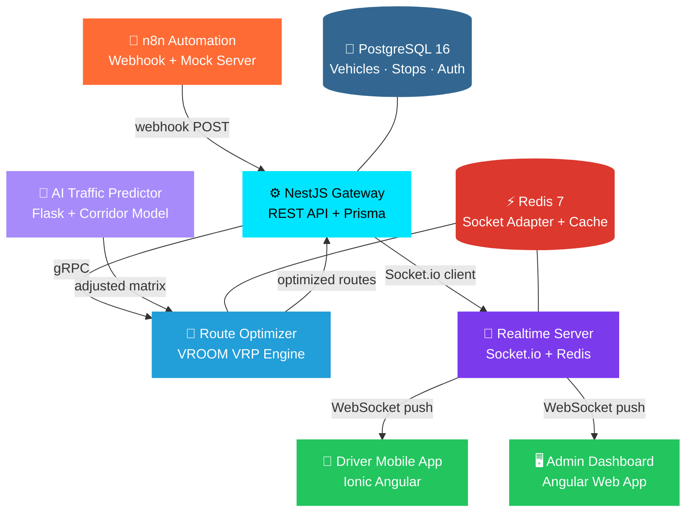

# 🚦 LogiFlow — Backend Services

[](https://github.com/Logiflow-Gavilanes-ECI/logiflow/actions/workflows/ci.yml)
[](https://sonarcloud.io/summary/new_code?id=Logiflow-Gavilanes-ECI_logiflow)
[](https://sonarcloud.io/summary/new_code?id=Logiflow-Gavilanes-ECI_logiflow)
[](LICENSE)
[](https://nodejs.org/)
[](https://www.python.org/)
[](https://www.docker.com/)
[](https://www.postgresql.org/)
[](https://redis.io/)

```
  ██╗      ██████╗  ████���█╗ ██╗███████╗██╗      ██████╗ ██╗    ██╗
  ██║     ██╔═══██╗██╔════╝ ██║██╔════╝██║     ██╔═══██╗██║    ██║
  ██║     ██║   ██║██║  ███╗██║█████╗  ██║     ██║   ██║██║ █╗ ██║
  ██║     ██║   ██║██║   ██║██║██╔══╝  ██║     ██║   ██║██║███╗██║
  ███████╗╚██████╔╝╚██████╔╝██║██║     ███████╗╚██████╔╝╚███╔███╔╝
  ╚══════╝ ╚═════╝  ╚═════╝ ╚═╝╚═╝     ╚══════╝ ╚═════╝  ╚══╝╚══╝
```

> **AI-powered real-time fleet routing — solving the Vehicle Routing Problem, one traffic jam at a time.**

---

## 🗺️ What is LogiFlow?

LogiFlow is a scalable, real-time fleet routing platform built for the Colombian logistics landscape. It continuously solves the **Vehicle Routing Problem (VRP)** across multiple vehicles and delivery points — optimizing routes on the fly whenever traffic, weather, or a new urgent order changes the picture.

Every reroute is calculated in **under 4 seconds** and pushed instantly to drivers via WebSockets. No polling. No stale routes. No missed windows.

---

## 🏗️ System Architecture



### Data Flow

```mermaid
sequenceDiagram
    participant A as n8n Automation
    participant GW as Gateway (NestJS)
    participant OPT as Optimizer (gRPC)
    participant AI as AI Predictor
    participant RT as Realtime (Socket.io)
    participant APP as Mobile / Web

    A->>GW: POST /api/v1/webhook/optimize
    GW->>OPT: gRPC OptimizeRoutes()
    OPT->>AI: POST /adjust (duration matrix)
    AI-->>OPT: AI-adjusted durations
    OPT-->>GW: Optimized routes
    GW->>RT: POST /emit/route-update
    RT-->>APP: WebSocket "route:update"
```

---

## 📦 Monorepo Structure

```
logiflow/
├── services/
│   ├── gateway/            ← NestJS REST API, Prisma ORM, JWT Auth, gRPC Client
│   ├── optimizer/          ← gRPC Server + VROOM VRP Engine + Google Routes
│   ├── realtime/           ← Socket.io Server + Redis Adapter
│   ├── automation/         ← n8n Webhook Mock Server + Message Builder
│   └── ai-predictor/       ← Python Flask Traffic Prediction Service
├── shared/
│   └── proto/
│       └── optimizer.proto ← gRPC contract (single source of truth)
├── docker-compose.yml      ← Full system orchestration (7 containers)
└── .github/
    └── workflows/          ← CI/CD pipelines + SonarCloud
```

---

## 🧩 Service Details

| Service | Tech Stack | Port | Purpose |
|---------|-----------|------|---------|
| **Gateway** | NestJS · TypeScript · Prisma · PostgreSQL | `3002` | REST API, auth (JWT + refresh tokens), vehicle/stop CRUD, gRPC client |
| **Optimizer** | Node.js · gRPC · VROOM · Axios | `50051` | VRP solver, Google Routes integration, Redis caching |
| **Realtime** | Socket.io · Redis Adapter · Express | `3001` | WebSocket rooms, position broadcast, heartbeat monitoring |
| **Automation** | Express · n8n Webhooks | `5678` | Event triggers, mock server for testing |
| **AI-Predictor** | Python · Flask | `5001` | Traffic corridor model, peak-hour duration adjustments |
| **PostgreSQL** | PostgreSQL 16 Alpine | `5432` | Persistent storage for vehicles, stops, users, tokens |
| **Redis** | Redis 7 Alpine | `6379` | Socket.io adapter, route cache, pub/sub |

---

## 🚀 Quick Start

### Prerequisites

| Tool | Version |
|------|---------|
| [Docker + Docker Compose](https://docs.docker.com/compose/) | 24+ |
| [Node.js](https://nodejs.org/) | 22+ |
| [Python](https://www.python.org/) | 3.12+ (for AI service only) |

### Run the full system

```bash
git clone https://github.com/Logiflow-Gavilanes-ECI/logiflow.git
cd logiflow
docker compose up -d
```

All 7 containers start and wire up automatically. Wait ~60 seconds for the gateway to compile and run migrations.

### Verify services

```bash
# Check all containers are running
docker compose ps

# Test Gateway API
curl http://localhost:3002/api/v1/vehicles

# Test AI Predictor health
curl http://localhost:5001/health

# Check Gateway logs
docker logs logiflow-gateway --tail 20
```

### Run a single service

```bash
cd services/optimizer
docker compose up
```

See each service's own `README.md` for environment variables and test instructions.

---

## 🔌 API Endpoints

### Gateway REST API (`localhost:3002/api/v1`)

| Method | Endpoint | Auth | Description |
|--------|----------|------|-------------|
| `POST` | `/auth/login` | ❌ | Login with credentials |
| `POST` | `/auth/register` | ❌ | Register new user |
| `POST` | `/auth/refresh` | ❌ | Refresh access token |
| `GET` | `/vehicles` | ✅ | List all vehicles |
| `POST` | `/vehicles` | ✅ | Create vehicle |
| `GET` | `/vehicles/:id` | ✅ | Get vehicle by ID |
| `PUT` | `/vehicles/:id` | ✅ | Update vehicle |
| `DELETE` | `/vehicles/:id` | ✅ | Delete vehicle |
| `GET` | `/stops` | ✅ | List all stops |
| `POST` | `/stops` | ✅ | Create stop |
| `DELETE` | `/stops/:id` | ✅ | Delete stop |
| `POST` | `/webhook/optimize` | ✅ | Trigger route optimization |

### gRPC Contract

```protobuf
service RouteOptimizer {
  rpc OptimizeRoutes (OptimizeRequest) returns (OptimizeResponse);
}
```

### Socket.io Events

| Event | Direction | Payload |
|-------|-----------|---------|
| `vehicle:position` | Client → Server | `{ vehicleId, lat, lng, speed }` |
| `route:update` | Server → Client | `{ vehicleId, stops, polyline, estimatedTime }` |
| `vehicle:offline` | Server → Client | `{ vehicleId }` |
| `vehicle:online` | Server → Client | `{ vehicleId }` |

---

## 🔐 Authentication

JWT-based auth with refresh token rotation:

1. **Login** → returns `accessToken` + `refreshToken`
2. **Access token** expires in 1 hour (configurable via `JWT_EXPIRES_IN`)
3. **Refresh token** stored hashed in PostgreSQL, 7-day TTL
4. **Token rotation** — each refresh consumes the old token and issues a new pair
5. **Password hashing** — scrypt with random 16-byte salt for registered users

---

## 🌿 Git Workflow

```
main          ← stable, demo-ready. Protected.
└── develop   ← sprint integration target. Protected.
    ├── feat/optimizer-grpc
    ├── feat/nestjs-core
    ├── feat/socket-gateway
    └── feat/n8n-ci
```

**Commit convention** — [Conventional Commits](https://www.conventionalcommits.org/):

```bash
feat(optimizer): add gRPC server with VROOM proxy
fix(gateway): correct proto import path
chore: add root docker-compose integration file
```

---

## 🧪 Testing

Each service runs its own test suite:

```bash
cd services/gateway
npm test              # Jest + coverage
npm run test:watch    # watch mode
npm run lint          # ESLint
```

CI runs on every push to `main`, `develop`, and `feat/**`:


---

## ⚙️ Environment Variables

### Gateway

| Variable | Default | Description |
|----------|---------|-------------|
| `PORT` | `3002` | HTTP listen port |
| `DATABASE_URL` | — | PostgreSQL connection string |
| `JWT_SECRET` | — | JWT signing secret (required) |
| `JWT_EXPIRES_IN` | `1h` | Access token TTL |
| `GRPC_OPTIMIZER_HOST` | `optimizer` | Optimizer service hostname |
| `GRPC_OPTIMIZER_PORT` | `50051` | Optimizer gRPC port |
| `SOCKETIO_SERVER_HOST` | `realtime` | Realtime service hostname |
| `SOCKETIO_SERVER_PORT` | `3001` | Realtime service port |

### Optimizer

| Variable | Default | Description |
|----------|---------|-------------|
| `GRPC_PORT` | `50051` | gRPC listen port |
| `VROOM_URL` | `http://vroom:3000` | VROOM engine URL |
| `REDIS_URL` | `redis://redis:6379` | Redis connection |
| `AI_PREDICTOR_URL` | `http://ai-predictor:5001/adjust` | AI service endpoint |

### Realtime

| Variable | Default | Description |
|----------|---------|-------------|
| `PORT` | `3001` | HTTP/WS listen port |
| `REDIS_URL` | `redis://redis:6379` | Redis connection for adapter |

---

## 👥 Team

| Name | Handle | Service Ownership |
|------|--------|-------------------|
| **Andersson David Sánchez Méndez** | @AnderssonProgramming | `automation` — n8n + CI |
| **Cristian Santiago Pedraza Rodríguez** | @cris-eci | `optimizer` — gRPC + VROOM |
| **Elizabeth Correa Suárez** | @Eliza-05 | `realtime` — Socket.io + Redis |
| **Juan Sebastian Ortega Muñoz** | @Juanseom | `gateway` — NestJS + Prisma |

---

## 📄 License

MIT © 2026 LogiFlow — Escuela Colombiana de Ingeniería Julio Garavito
