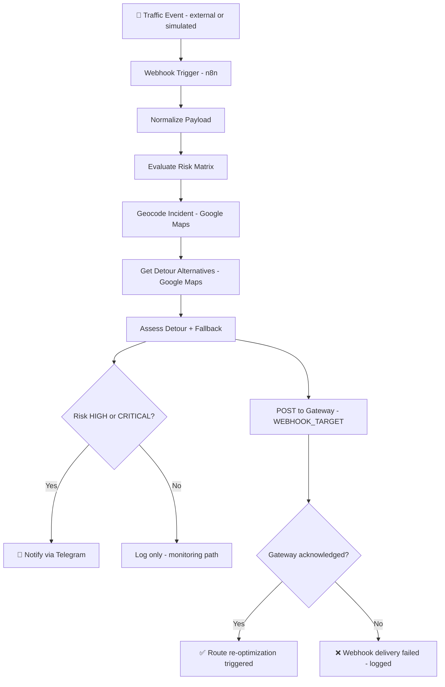
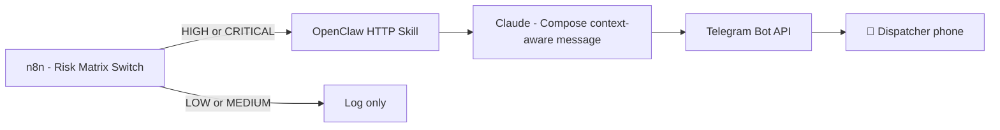

# LogiFlow — Automation Service

[](https://github.com/Logiflow-Gavilanes-ECI/logiflow/actions)
[](https://sonarcloud.io)
[](https://nodejs.org/)
[](https://n8n.io/)
[](#)
[](#-telegram-notifications)
[](LICENSE)

```
██╗      ██████╗  ██████╗ ██╗███████╗██╗      ██████╗ ██╗    ██╗
██║     ██╔═══██╗██╔════╝ ██║██╔════╝██║     ██╔═══██╗██║    ██║
██║     ██║   ██║██║  ███╗██║█████╗  ██║     ██║   ██║██║ █╗ ██║
██║     ██║   ██║██║   ██║██║██╔══╝  ██║     ██║   ██║██║███╗██║
███████╗╚██████╔╝╚██████╔╝██║██║     ███████╗╚██████╔╝╚███╔███╔╝
╚══════╝ ╚═════╝  ╚═════╝ ╚═╝╚═╝     ╚══════╝ ╚═════╝  ╚══╝╚══╝
```

> **AI-powered real-time fleet routing — solving the Vehicle Routing Problem, one traffic jam at a time.**

---

## 📖 Table of Contents

1. [What This Service Does](#-what-this-service-does)
2. [How It All Connects](#-how-it-all-connects)
3. [Quick Start](#-quick-start)
4. [End-to-End Flow Explained](#-end-to-end-flow-explained)
5. [Risk Matrix](#-risk-matrix)
6. [Maps Enrichment](#-maps-enrichment)
7. [Telegram Notifications](#-telegram-notifications)
8. [Why OpenClaw Instead of Twilio](#-why-openclaw-instead-of-twilio-adr)
9. [Testing](#-testing)
10. [CI Pipeline](#️-ci-pipeline)
11. [Project Structure](#-project-structure)
12. [Troubleshooting](#️-troubleshooting)
13. [Team](#-team)

---

## 📦 What This Service Does

`services/automation` is the **event detection, enrichment, and notification** component of LogiFlow. It is the first responder when something changes in the field.

When a traffic event occurs — a road closure, a jam, a weather alert — this service:

1. **Receives** the event via an HTTP webhook (n8n)
2. **Classifies** its risk level using a deterministic Risk Matrix
3. **Enriches** the incident with real geolocation and detour data (Google Maps)
4. **Triggers** route re-optimization by notifying the gateway
5. **Alerts** the operations team via Telegram when impact is HIGH or CRITICAL

This service does not run the optimization itself — that is the responsibility of the VROOM microservice called via gRPC. This service is purely the automation and alerting layer.

| Responsibility | Implementation |
|---|---|
| Receive traffic events | n8n Webhook Trigger |
| Classify risk | Risk Matrix (severity + eventType) |
| Enrich with map data | Google Geocoding + Directions API |
| Trigger re-optimization | HTTP POST to `WEBHOOK_TARGET` |
| Notify operations | Telegram Bot API via n8n |
| Enforce code quality | ESLint + Jest + SonarCloud |

---

## 🏗️ How It All Connects

This diagram shows the full data flow from a raw traffic event to a notified dispatcher:



> **Key design principle:** the notification path and the re-optimization path are independent. A Telegram failure never blocks the reroute trigger, and a gateway failure never suppresses the alert.

---

## 🚀 Quick Start

### Prerequisites

- [Node.js 20+](https://nodejs.org/)
- [Docker + Docker Compose](https://docs.docker.com/compose/)
- Google Maps API key (Geocoding + Directions APIs enabled)
- Telegram Bot token + Chat ID (see [Telegram Notifications](#-telegram-notifications))

### 1 — Install dependencies

```bash
cd services/automation
npm install
```

### 2 — Configure environment

```bash
cp .env.example .env
```

Open `.env` and fill in:

```env
# Gateway
WEBHOOK_TARGET=http://your-gateway-url/reroute

# Google Maps
GOOGLE_MAPS_API_KEY=your_google_maps_key

# Telegram
TELEGRAM_BOT_TOKEN=your_telegram_bot_token
TELEGRAM_CHAT_ID=your_chat_id

# OpenClaw (optional — needed only if running the OpenClaw path)
ANTHROPIC_API_KEY=your_anthropic_key
OPENCLAW_WEBHOOK_URL=http://openclaw:18789
```

Also create `services/automation/n8n/.env` from `n8n/.env.example` for the Docker Compose variables used by n8n.

### 3 — Start n8n

```bash
docker network create logiflow-net
cd services/automation/n8n
docker compose up -d
```

n8n UI available at: `http://localhost:5678`

### 4 — Import the workflow

1. Open `http://localhost:5678`
2. Go to **Workflows → Import from File**
3. Select `n8n/workflows/traffic-event-trigger.json`
4. **Activate** the workflow (toggle top-right)

> If you modify the JSON file locally, re-import and re-activate. n8n stores workflows in its own database.

### 5 — Send a test event

```bash
curl -X POST "http://localhost:5678/webhook/logiflow/traffic-event" \
  -H "Content-Type: application/json" \
  -d '{
    "eventType": "road_closure",
    "severity": "CRITICAL",
    "locationDescription": "Autopista Norte - Calle 100, Bogota",
    "vehicles": [{"id": "v-001", "lat": 4.7110, "lng": -74.0721, "capacity": 12}],
    "stops": [{"id": "s-101", "lat": 4.7050, "lng": -74.0680, "demand": 2, "priority": 1}]
  }'
```

**Expected result:**
- Workflow runs end-to-end ✅
- Gateway receives the reroute trigger ✅
- Telegram alert arrives on your phone ✅

---

## 🔄 End-to-End Flow Explained

Understanding what happens inside each step helps when debugging or extending the workflow.

**Step 1 — Webhook Trigger:** n8n exposes a public endpoint (via ngrok in local dev). Any system — or a manual curl — can POST a traffic event to this URL.

**Step 2 — Normalize Payload:** A Set node ensures all downstream nodes receive a consistent structure regardless of how the original payload arrived. Fields like `eventType` are lowercased, `severity` is uppercased.

**Step 3 — Risk Matrix:** A Switch node evaluates `severity + eventType` and assigns a `riskLevel` (`HIGH`, `MEDIUM`, `LOW`) and a `recommendedAction`. See the [Risk Matrix](#-risk-matrix) section.

**Step 4 — Maps Enrichment:** Two sequential HTTP Request nodes call Google Maps — first to geocode the incident location (text → coordinates + formatted address), then to get real detour alternatives from the affected area. If either call fails (quota exceeded, key invalid), a fallback node injects safe defaults so the workflow never stops.

**Step 5 — Gateway POST:** The enriched payload is sent to `WEBHOOK_TARGET` — the endpoint that will trigger VROOM route re-optimization. This happens regardless of risk level.

**Step 6 — Telegram Alert:** An IF node checks whether `riskLevel` is `HIGH` or `CRITICAL`. If yes, the Telegram node fires. If no, a log node records the skip reason and the workflow ends cleanly.

---

## 🧠 Risk Matrix

The risk classification is deterministic — no ML, no probabilities. Given an `eventType` and `severity`, the outcome is always the same.

| Severity | Event Type | Risk Level | Recommended Action |
|---|---|---|---|
| `CRITICAL` | `road_closure` | 🔴 HIGH | Reroute immediately and notify operations/driver |
| `HIGH` | `traffic_jam` | 🟠 MEDIUM | Calculate detour and monitor ETA impact |
| `LOW` | `weather_alert` | 🟡 LOW | Monitor conditions and keep current route |

**Fallback rule:** if no exact `eventType + severity` match is found, the Switch falls through to a severity-only rule: `CRITICAL` → HIGH, `HIGH` → MEDIUM, everything else → LOW.

---

## 📍 Maps Enrichment

Two Google Maps API calls enrich the raw event payload before it reaches the gateway.

**Geocode Incident** — converts `locationDescription` (a human-readable string like `"Autopista Norte - Calle 100, Bogotá"`) into:
- `incidentAddress`: formatted address from Google
- `incidentLat` / `incidentLng`: precise coordinates

**Get Detour Alternatives** — uses the incident coordinates as an avoided waypoint and requests up to 3 alternative routes. Produces:
- `alternativeRoutes`: count of viable detours found
- `detourRecommended`: boolean
- `bestRoute.durationInTrafficSec`: estimated travel time on the best alternative

**Fallback behavior:** if Google returns `REQUEST_DENIED`, `OVER_QUERY_LIMIT`, or any network error, a fallback Set node injects neutral defaults (`detourRecommended: false`, `alternativeRoutes: 0`) and the workflow continues. The reroute trigger and Telegram alert still fire.

---

## 🔔 Telegram Notifications

Alerts are sent directly from n8n to the Telegram Bot API. No external notification service is required.

### Message format

```
LogiFlow Alert 🚨
─────────────────────────
Risk:      HIGH
Event:     ROAD_CLOSURE
Severity:  CRITICAL
Address:   Autopista Norte - Calle 100, Bogotá, Colombia
Detour alternatives: 2
Detour recommended:  Yes
Action:    Reroute immediately and notify operations/driver
Timestamp: 2026-03-13T12:00:00.000Z
```

### Bot setup (BotFather)

1. Open Telegram → search `@BotFather` → send `/newbot`
2. Choose a display name: `LogiFlow Alerts`
3. Choose a username: `logiflow_alerts_bot`
4. Copy the token → add to `.env` as `TELEGRAM_BOT_TOKEN`
5. Open a chat with your new bot and send any message to activate it
6. Get your `TELEGRAM_CHAT_ID`:

```bash
curl https://api.telegram.org/bot<YOUR_TOKEN>/getUpdates
# Look for "chat": { "id": 123456789 } in the response
```

7. Add that ID to `.env` as `TELEGRAM_CHAT_ID`

Alerts only fire for `HIGH` and `CRITICAL` risk levels. `MEDIUM` and `LOW` events are logged internally but do not produce a notification.

---

## 🤖 Why OpenClaw Instead of Twilio (ADR)

This section documents the architectural decision made at the start of Sprint 2, Step 5.

### What was considered

**Option A — Twilio + WhatsApp Business API**

The original plan. Twilio is battle-tested and WhatsApp has massive reach in Colombia (the target market for LogiFlow).

**Why it was rejected:**
- WhatsApp Business API requires manual approval from Meta — a process that can take days or weeks, which is incompatible with a sprint deadline
- Twilio adds a paid per-message dependency with no free tier for production use
- Introduces an external billing account and API key management overhead for an academic project

**Option B — OpenClaw + Telegram (chosen)**

OpenClaw is an open-source autonomous AI agent that runs locally in Docker. It uses messaging platforms — Telegram, WhatsApp, Discord, Slack — as its primary user interface, and routes messages through a configured LLM (Claude in this project).

**Why it was chosen:**
- Zero cost — no billing, no approval, no rate limits for development
- Telegram bot setup via BotFather takes under 5 minutes
- OpenClaw runs entirely in Docker alongside n8n on `logiflow-net` — no external dependencies
- Acts as an **AI reasoning layer**, not just a forwarder: it receives the structured JSON payload and uses Claude to compose a context-aware, human-readable message rather than a templated string
- Separates concerns cleanly: n8n handles orchestration, OpenClaw handles intelligence and delivery

### OpenClaw in the LogiFlow architecture



> **Current status:** the direct Telegram node in n8n is the validated runtime path. The OpenClaw path is fully documented and runnable for demonstration purposes, and represents the target architecture for Sprint 3 when the reasoning layer becomes more relevant.

### Running OpenClaw locally

```bash
# Ensure the shared network exists
docker network create logiflow-net

# Start OpenClaw
docker compose -f openclaw/docker-compose.yml up -d

# Start n8n (if not already running)
docker compose -f n8n/docker-compose.yml up -d

# Start mock server
node mock-server/index.js
```

---

## 🧪 Testing

```bash
# Lint
npm run lint

# Unit tests with coverage report
npm test

# Watch mode for development
npm run test:watch
```

### Test coverage

| File | What is tested |
|---|---|
| `test/workflow.test.js` | Payload contract, required fields, coordinate ranges, enum values |
| `test/notify.test.js` | Message builder output, missing field errors, emoji by severity, timestamp formatting |

Coverage threshold is enforced by Jest. The CI pipeline fails if coverage drops below 80%.

---

## ⚙️ CI Pipeline

Every push to `main`, `develop`, or any `feature/**` branch triggers the pipeline automatically.

```
push / pull_request
      ↓
Install dependencies (npm ci)
      ↓
ESLint (npm run lint)
      ↓
Jest + coverage (lcov report generated)
      ↓
SonarCloud analysis
```

### Required GitHub secret

| Secret | Where to get it |
|---|---|
| `SONAR_TOKEN` | sonarcloud.io → your project → Administration → Analysis Method |

### PR checklist before merge

- [ ] `npm run lint` passes locally
- [ ] `npm test` passes with no failures
- [ ] n8n workflow re-imported and activated after any JSON changes
- [ ] Telegram alert validated manually with a `CRITICAL` payload

---

## 📁 Project Structure

```
services/automation/
├── .github/
│   └── workflows/
│       └── ci.yml                        ← GitHub Actions pipeline
├── mock-server/
│   ├── index.js                          ← Express server (stand-in for NestJS gateway)
│   └── message-builder.js               ← Pure function: builds Telegram message string
├── n8n/
│   ├── docker-compose.yml               ← n8n Docker service on logiflow-net
│   └── workflows/
│       └── traffic-event-trigger.json   ← Full n8n workflow (importable)
├── openclaw/
│   ├── docker-compose.yml               ← OpenClaw Docker service on logiflow-net
│   ├── openclaw.json                    ← OpenClaw config template (no secrets)
│   └── skills/
│       └── logiflow-notify.js           ← Custom skill: receives payload, calls Telegram
├── postman/
│   └── LogiFlow-Sprint2.json            ← Postman collection for manual testing
├── sample-data/
│   └── traffic-event.json               ← Shared payload contract (used by all services)
├── test/
│   ├── workflow.test.js                 ← Payload validation tests
│   └── notify.test.js                   ← Message builder tests
├── .env.example                         ← All required variables with comments
├── .eslintrc.json
├── .gitignore
├── package.json
├── sonar-project.properties
└── README.md
```

---

## 🛠️ Troubleshooting

**`Wrong type: 'true' is a boolean but was expecting a string` in n8n**

This happens in the `Notification Delivered?` IF node when the comparison type is wrong. Fix:
- Left value: `={{ $json.ok }}`
- Operator type: `boolean`
- Right value: `true` (not the string `"true"`)

**Telegram alert arrives but the workflow shows an error downstream**

The Telegram node succeeded but a downstream IF node is comparing incompatible types. Check that all IF nodes use the correct value types (boolean vs string).

**Google Maps returns `REQUEST_DENIED`**

Your API key does not have Geocoding or Directions API enabled. Go to [Google Cloud Console](https://console.cloud.google.com/) → APIs & Services → Enable both APIs for your key.

**n8n cannot reach OpenClaw**

Both services must be on the same Docker network. Verify with:
```bash
docker network inspect logiflow-net
```
Both `n8n` and `openclaw` containers must appear in the output.

**Port reference**

| Service | Port |
|---|---|
| n8n | `5678` |
| Mock server | `3002` |
| OpenClaw Gateway | `18789` |

---

## 🔒 Security Notes

- Never commit `.env` files — they are in `.gitignore`
- Rotate any token or key immediately if it appears in logs, chat, or a commit
- `sonar-project.properties` contains no secrets — it is safe to commit
- OpenClaw config template (`openclaw.json`) uses `${ENV_VAR}` placeholders — actual values come from `.env` only

---

## 👥 Team

| Name | Role |
|---|---|
| **Andersson David Sánchez Méndez** | DevOps / Automation Engineer |
| **Cristian Santiago Pedraza Rodríguez** | Backend Engineer |
| **Elizabeth Correa Suárez** | Frontend Engineer |
| **Juan Sebastián Ortega Muñoz** | Optimization / Algorithms Engineer |

---

## 📄 License

MIT © 2026 LogiFlow — Escuela Colombiana de Ingeniería Julio Garavito