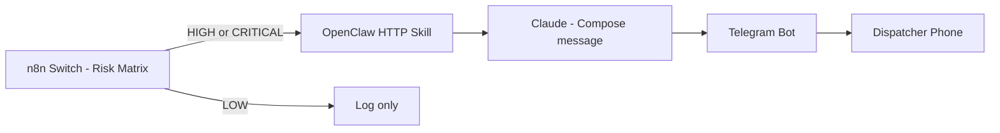

# 🚦 LogiFlow — n8n Event Trigger & CI

[](https://github.com/Logiflow-Gavilanes-ECI/logiflow-n8n-trigger/actions/workflows/ci.yml)
[](https://sonarcloud.io/summary/new_code?id=Logiflow-Gavilanes-ECI_logiflow-n8n-trigger)
[](https://nodejs.org/)
[](LICENSE)

```
  ██╗      ██████╗  ██████╗ ██╗███████╗██╗      ██████╗ ██╗    ██╗
  ██║     ██╔═══██╗██╔════╝ ██║██╔════╝██║     ██╔═══██╗██║    ██║
  ██║     ██║   ██║██║  ███╗██║█████╗  ██║     ██║   ██║██║ █╗ ██║
  ██║     ██║   ██║██║   ██║██║██╔══╝  ██║     ██║   ██║██║███╗██║
  ███████╗╚██████╔╝╚██████╔╝██║██║     ███████╗╚██████╔╝╚███╔███╔╝
  ╚══════╝ ╚═════╝  ╚═════╝ ╚═╝╚═╝     ╚══════╝ ╚═════╝  ╚══╝╚══╝
```

> **AI-powered real-time fleet routing — solving the Vehicle Routing Problem, one traffic jam at a time.**

---

## 📦 This Module

`logiflow-n8n-trigger` is the **event detection and CI automation** component of the LogiFlow platform. Its responsibilities:

| Responsibility | How |
|---|---|
| Receive external traffic events | n8n workflow with Webhook Trigger |
| Deliver event payloads to the backend | HTTP POST to configured `WEBHOOK_TARGET` |
| Stand in for the real NestJS backend (Sprint 1) | Lightweight Express mock server |
| Enforce code quality on every push | GitHub Actions → ESLint → Jest → SonarCloud |

In Sprint 2, the mock server will be replaced by the real NestJS backend, and the n8n workflow will be connected to a live traffic data feed.

---

## 🏗️ Architecture

```mermaid
graph LR
    A["🔔 n8n\n(Traffic Event Trigger)"] -->|HTTP POST| B["🖥️ Mock Server\n(Sprint 1 stand-in)"]
    B -.->|Sprint 2| C["⚙️ NestJS Backend\n(Webhook Handler)"]
    C -->|gRPC| D["🧮 VROOM Optimizer\n(VRP Solver)"]
    D -->|Optimized Routes| E["📡 Socket.io\n(Real-time Push)"]
    E -->|New Route| F["🚛 Driver App"]
    
    style A fill:#ff6b35,color:#fff
    style B fill:#ffd166,color:#000
    style C fill:#06d6a0,color:#fff
    style D fill:#118ab2,color:#fff
    style E fill:#073b4c,color:#fff
    style F fill:#ef476f,color:#fff
```



> **Data flow:** A traffic jam is detected → n8n builds the event payload → POSTs to the backend → VROOM recalculates optimal routes → Socket.io pushes updates to affected drivers instantly.

---

## 🚀 Quick Start

### Prerequisites

- [Node.js 20+](https://nodejs.org/)
- [Docker + Docker Compose](https://docs.docker.com/compose/)
- [n8n Desktop](https://n8n.io/get-started/) or access to the Docker-based n8n instance

---

### Step 1 — Clone & Install

```bash
git clone https://github.com/Logiflow-Gavilanes-ECI/logiflow-n8n-trigger.git
cd logiflow-n8n-trigger
npm install
```

---

### Step 2 — Start the Mock Server

```bash
npm start
```

Expected output:

```
[LogiFlow] Mock webhook server running on http://localhost:3002
[LogiFlow] Listening for POST /webhooks/traffic-event
```

> The server listens on **port 3002** by default to avoid conflicts with the gateway service on port 3000. Keep this terminal open.

---

### Step 3 — Start n8n via Docker

Before starting n8n, configure environment variables for webhook forwarding and Google Maps:

```bash
cd n8n
cp .env.example .env
```

Set `GOOGLE_MAPS_API_KEY` in `n8n/.env`.

```bash
cd n8n
docker compose up -d
```

n8n will be available at **http://localhost:5678**.

> The `extra_hosts` setting in `docker-compose.yml` ensures that `host.docker.internal` resolves correctly on Linux hosts.

---

### Step 4 — Import the Workflow

1. Open **http://localhost:5678** in your browser
2. Go to **Workflows → Import from File**
3. Select `n8n/workflows/traffic-event-trigger.json`
4. The workflow **"Traffic Event Trigger – LogiFlow"** will appear

---

### Step 5 — Trigger the Workflow via External POST

1. Open the **"Traffic Event Webhook"** node and copy its **Production URL**
2. Send a POST request to that URL with a valid payload:

```bash
curl -X POST "http://localhost:5678/webhook/logiflow/traffic-event" \
  -H "Content-Type: application/json" \
  -d '{
    "eventType": "traffic_jam",
    "severity": "HIGH",
    "vehicles": [
      { "id": "v-001", "lat": 4.7110, "lng": -74.0721, "capacity": 12 }
    ],
    "stops": [
      { "id": "s-101", "lat": 4.7050, "lng": -74.0680, "demand": 2, "priority": 1 }
    ]
  }'
```

Risk matrix is evaluated in the `Evaluate Risk Matrix` node using `severity + eventType`.

| Severity | Event Type | Risk Level | Recommended Action |
|---|---|---|---|
| `CRITICAL` | `ROAD_CLOSURE` | `HIGH` | Reroute immediately and notify operations/driver |
| `HIGH` | `TRAFFIC_JAM` | `MEDIUM` | Calculate detour and monitor ETA impact |
| `LOW` | `WEATHER_ALERT` | `LOW` | Monitor conditions and keep current route |

If an event type is not natively supported by the gateway DTO, the workflow maps it to a compatible gateway value while preserving the original type in risk metadata.

## Step 5 — Telegram Notifications via OpenClaw

### Architecture Decision Record (ADR)

**Considered option:** Twilio + WhatsApp Business API.

**Why it was rejected:**
- WhatsApp Business API requires Meta manual approval (days/weeks), which is not sprint-friendly.
- Twilio introduces a paid per-message dependency.
- It adds an external operational dependency for a feature that can run locally.

**Chosen option:** OpenClaw + Telegram (BotFather).

**Why this is better for Sprint 2:**
- Zero-cost local runtime.
- No approval process required.
- Native Telegram support with fast setup.
- OpenClaw is not only a forwarder: it is the reasoning layer that composes context-aware alerts using Claude.

### What OpenClaw Does in LogiFlow

n8n handles orchestration and branching. OpenClaw handles intelligence and delivery. n8n sends structured risk payloads, OpenClaw transforms them into dispatcher-friendly natural language alerts, and Telegram delivers those alerts to phones.



### BotFather Setup

1. Open Telegram and search `@BotFather`, then run `/newbot`.
2. Use bot name `LogiFlow Alerts` and username `logiflow_alerts_bot` (or similar available username).
3. Copy the token and put it in `.env` as `TELEGRAM_BOT_TOKEN`.
4. Start a chat with your new bot to activate it.
5. Get your chat ID using `https://api.telegram.org/bot<TOKEN>/getUpdates`.

### Running Step 5

```bash
docker network create logiflow-net   # if not already created
cp openclaw/.env.example openclaw/.env
docker compose -f openclaw/docker-compose.yml up -d
docker compose -f n8n/docker-compose.yml up -d
node mock-server/index.js
```

### OpenClaw Notification Payload Contract

n8n sends this payload to OpenClaw for HIGH/CRITICAL branches:

```json
{
  "eventType": "ROAD_CLOSURE",
  "severity": "CRITICAL",
  "locationDescription": "Autopista Norte - Calle 100, Bogota",
  "affectedVehicles": ["V001", "V003"],
  "riskLevel": "HIGH",
  "action": "Reroute immediately and notify operations/driver",
  "timestamp": "2026-03-13T12:00:00.000Z"
}
```

3. The workflow now enriches the event with Google Maps data before calling the backend:

- `Geocode Incident` resolves a location description to coordinates
- `Get Detour Alternatives` requests live route alternatives from Directions API
- `Assess Detour` computes `detourRecommended` and alternative route count

4. In n8n execution details, the final **"Success – Route Re-optimization"** node should output:

```json
{
  "message": "Route re-optimization triggered successfully",
  "vehiclesAffected": 1,
  "triggeredAt": "2026-03-02T10:00:00.000Z",
  "detourRecommended": true,
  "alternativeRoutes": 1,
  "incidentAddress": "Autopista Norte - Calle 100, Bogota, Colombia"
}
```

---

### Bonus — Manual Testing with Postman

Import `postman/LogiFlow-Sprint1.json` into Postman and run both requests:

| Request | Expected |
|---|---|
| POST with valid payload | `200 OK` · `{ "status": "received" }` |
| POST with empty body | `400 Bad Request` · missing fields message |

---

## ⚙️ CI Pipeline

Every push to `main`, `develop`, or any `feature/**` branch triggers the pipeline:

```
push / pull_request
        │
        ▼
┌────────────────────┐
│  1. Checkout code  │  (full history for SonarCloud blame)
└────────┬───────────┘
         │
┌────────▼───────────┐
│  2. Setup Node 20  │  (with npm cache)
└────────┬───────────┘
         │
┌────────▼───────────┐
│  3. npm ci         │  (clean install from lock file)
└────────┬───────────┘
         │
┌────────▼───────────┐
│  4. ESLint         │  → enforces no-var, prefer-const, eqeqeq, curly
└────────┬───────────┘
         │
┌────────▼───────────┐
│  5. Jest + lcov    │  → unit tests + coverage report
└────────┬───────────┘
         │
┌────────▼───────────┐
│  6. SonarCloud     │  → quality gate, duplications, bugs, smells
└────────────────────┘
```

### Required Secrets (GitHub → Settings → Secrets → Actions)

| Secret | Description |
|---|---|
| `SONAR_TOKEN` | Generated in SonarCloud under your account |

---

## 📁 Project Structure

```
logiflow-n8n-trigger/
├── .github/
│   └── workflows/
│       └── ci.yml              # GitHub Actions: lint → test → SonarCloud
├── n8n/
│   ├── docker-compose.yml      # Spins up n8n on port 5678
│   └── workflows/
│       └── traffic-event-trigger.json  # Importable n8n workflow (6 nodes)
├── mock-server/
│   └── index.js                # Express server – stands in for NestJS (Sprint 1)
├── sample-data/
│   └── traffic-event.json      # Shared team payload contract
├── test/
│   └── workflow.test.js        # Jest unit tests: payload + mock server
├── postman/
│   └── LogiFlow-Sprint1.json   # Postman collection for manual testing
├── .eslintrc.json              # ESLint rules (no-var, prefer-const, strict equality)
├── .gitignore                  # Ignores node_modules, coverage, .env, dist
├── sonar-project.properties    # SonarCloud configuration
├── package.json                # Scripts: start, lint, test, test:watch
└── README.md                   # You are here 👋
```

---

## 🧪 Running Tests

```bash
# Run all tests with coverage
npm test

# Run in watch mode during development
npm run test:watch

# Run linter
npm run lint
```

Expected test output:

```
PASS test/workflow.test.js
  Traffic Event Payload
    ✓ should contain all required fields
    ✓ affectedVehicles should be a non-empty array
    ✓ eventType should be a valid enum value
    ✓ location should have valid Bogotá coordinate ranges
    ✓ severity should be a valid enum value
  Traffic Event Payload – Mock Server Validation
    ✓ should return 200 with valid payload
    ✓ should return 400 when eventType is missing
    ✓ should return 400 when affectedVehicles is missing
    ✓ should return 400 when body is empty
```

---

## 👥 Team

| Name | Role |
|---|---|
| **Andersson David Sánchez Méndez** | DevOps / Automation Engineer |
| **Cristian Santiago Pedraza Rodríguez** | Backend Engineer |
| **Elizabeth Correa Suárez** | Frontend Engineer |
| **Juan Sebastian Ortega Muñoz** | Optimization / Algorithms Engineer |

---

## 📄 License

MIT © 2026 LogiFlow — Escuela Colombiana de Ingeniería Julio Garavito