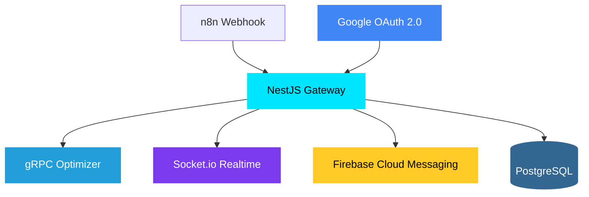

<div align="center">

# LogiFlow Core Backend

NestJS service that orchestrates webhook events, gRPC route optimization, real-time socket updates, push notifications, and CRUD APIs for vehicles/stops.

[](https://nestjs.com/)
[](https://www.typescriptlang.org/)
[](https://nodejs.org/)
[](https://www.prisma.io/)
[](https://jestjs.io/)

</div>

---

## Overview

LogiFlow is an ARSW - Software Architecture university project that solves dynamic fleet routing in real time. When logistics events occur (new orders, traffic changes, vehicle incidents), this gateway:

1. Receives events from n8n via webhook.
2. Calls a gRPC optimizer service (VROOM).
3. Emits route updates to a Socket.io real-time service.
4. Sends **Firebase push notifications** to driver mobile devices.
5. Secures critical routes with **JWT + Google OAuth 2.0** authentication.
6. Persists vehicle/stop/user data in PostgreSQL through Prisma.

---

## Architecture



### Modules

```text
AppModule
├── AuthModule (JWT + Google OAuth + Passport)
├── WebhookModule (event processing + gRPC + socket + push)
├── VehiclesModule (CRUD)
├── StopsModule (CRUD)
├── NotificationsModule (Firebase push + device tokens)
├── GrpcClientModule (RouteOptimizer client)
├── SocketClientModule (realtime emission)
├── RetryModule (exponential backoff + jitter)
├── PrismaModule (global, PostgreSQL)
└── ConfigModule (env vars)
```

---

## Tech Stack

| Technology       | Purpose                       | Version |
| ---------------- | ----------------------------- | ------- |
| NestJS           | Modular backend framework     | 11.x    |
| TypeScript       | Type-safe development         | 5.7     |
| Prisma           | ORM and DB access             | 7.5     |
| PostgreSQL       | Persistent storage            | 16+     |
| Passport         | JWT + Google OAuth strategies | 0.7     |
| Firebase Admin   | Push notification delivery    | 13.x    |
| @grpc/grpc-js    | gRPC client for optimizer     | 1.14    |
| socket.io-client | Real-time route emission      | 4.8     |
| Jest + ts-jest   | Unit/integration tests        | 30.x    |

---

## Project Structure

```text
services/gateway/
├── prisma/
│   ├── schema.prisma          ← User, RefreshToken, DeviceToken, Vehicle, Stop
│   └── migrations/            ← 4 migrations
├── src/
│   ├── app.module.ts
│   ├── main.ts
│   ├── auth/
│   │   ├── auth.controller.ts      ← login, register, refresh, Google OAuth
│   │   ├── auth.service.ts         ← JWT signing, password hashing, Google login
│   │   ├── jwt.strategy.ts         ← Passport JWT strategy
│   │   ├── google.strategy.ts      ← Passport Google OAuth strategy
│   │   ├── google-auth.guard.ts    ← Graceful 501 when Google not configured
│   │   └── dto/                    ← LoginDto, RegisterDto, RefreshDto
│   ├── notifications/
│   │   ├── notifications.service.ts    ← Firebase init, multicast push, token cleanup
│   │   ├── notifications.controller.ts ← POST /register-device
│   │   └── notifications.module.ts
│   ├── webhook/
│   │   ├── webhook.controller.ts
│   │   ├── webhook.service.ts     ← gRPC + socket + push dispatch
│   │   └── *.spec.ts
│   ├── common/
│   │   ├── middleware/correlation-id.middleware.ts
│   │   └── retry/                 ← RetryService, exponential backoff
│   ├── prisma/                    ← PrismaModule (global)
│   ├── grpc-client/
│   ├── socket-client/
│   ├── vehicles/
│   └── stops/
└── test/
```

---

## Getting Started

### Prerequisites

- Node.js 22+
- npm 10+
- PostgreSQL instance

### Installation

```bash
cd services/gateway
npm install
```

### Environment Variables

Create a `.env` file in `services/gateway`.

| Variable                         | Default                                             | Description                                                     |
| -------------------------------- | --------------------------------------------------- | --------------------------------------------------------------- |
| `PORT`                           | `3002`                                              | HTTP server port                                                |
| `DATABASE_URL`                   | —                                                   | Prisma PostgreSQL connection string                             |
| `JWT_SECRET`                     | —                                                   | Secret used to sign and verify JWT tokens (**required**)        |
| `JWT_EXPIRES_IN`                 | `1h`                                                | JWT token expiration                                            |
| `GRPC_OPTIMIZER_HOST`            | `localhost`                                         | Optimizer host                                                  |
| `GRPC_OPTIMIZER_PORT`            | `50051`                                             | Optimizer port                                                  |
| `SOCKETIO_SERVER_HOST`           | `localhost`                                         | Socket.io host                                                  |
| `SOCKETIO_SERVER_PORT`           | `3001`                                              | Socket.io port                                                  |
| `GOOGLE_CLIENT_ID`               | —                                                   | Google OAuth client ID (optional)                               |
| `GOOGLE_CLIENT_SECRET`           | —                                                   | Google OAuth client secret (optional)                           |
| `GOOGLE_CALLBACK_URL`            | `http://localhost:3002/api/v1/auth/google/callback` | OAuth callback                                                  |
| `GOOGLE_REDIRECT_FRONTEND`       | `http://localhost:4200`                             | Frontend redirect after OAuth                                   |
| `GOOGLE_REDIRECT_FRONTEND_ADMIN` | —                                                   | Optional admin redirect target used by `/auth/google?app=admin` |
| `FIREBASE_PROJECT_ID`            | —                                                   | Firebase project ID (optional)                                  |
| `FIREBASE_CLIENT_EMAIL`          | —                                                   | Firebase service account email (optional)                       |
| `FIREBASE_PRIVATE_KEY`           | —                                                   | Firebase private key (optional)                                 |

### Database Setup (Prisma)

```bash
npx prisma generate
npx prisma migrate deploy
npm run db:seed
```

The seed creates demo users for the web/admin demo:

| Email                    | Password      | Role        | JWT vehicleId       |
| ------------------------ | ------------- | ----------- | ------------------- |
| `admin@logiflow.app`     | `Admin2026!`  | `admin`     | resolved by backend |
| `conductor@logiflow.app` | `Driver2026!` | `conductor` | `v-001`             |
| `conductor2@logiflow.app` | `Driver2026!` | `conductor` | `v-002`            |

The seeded vehicles use distinct plates:

| Vehicle ID | Plate     | Model               |
| ---------- | --------- | ------------------- |
| `v-001`    | `ABC-123` | `Toyota Hilux 2023` |
| `v-002`    | `DEF-456` | `Renault Kangoo 2022` |

### Run the App

```bash
npm run start:dev     # development
npm run build && npm run start:prod  # production
```

Base URL: `http://localhost:3002/api/v1`

---

## API Endpoints

All routes are prefixed with `/api/v1`.

### Auth

| Method | Endpoint                | Description                                                    |
| ------ | ----------------------- | -------------------------------------------------------------- |
| `POST` | `/auth/login`           | Login with email + password                                    |
| `POST` | `/auth/register`        | Register new user (admin/conductor)                            |
| `POST` | `/auth/refresh`         | Refresh token rotation                                         |
| `GET`  | `/auth/google`          | Initiate Google OAuth redirect (`?app=admin` for admin target) |
| `GET`  | `/auth/google/callback` | Google OAuth callback (redirects to frontend `/auth/callback`) |
| `POST` | `/auth/google/token`    | Mobile: exchange Google ID token for JWT                       |

### Webhook

| Method | Endpoint   | Description                               |
| ------ | ---------- | ----------------------------------------- |
| `POST` | `/webhook` | Trigger route optimization (JWT required) |

### Vehicles CRUD

| Method   | Endpoint        |
| -------- | --------------- |
| `GET`    | `/vehicles`     |
| `GET`    | `/vehicles/:id` |
| `POST`   | `/vehicles`     |
| `PUT`    | `/vehicles/:id` |
| `DELETE` | `/vehicles/:id` |

### Stops CRUD

| Method   | Endpoint     |
| -------- | ------------ |
| `GET`    | `/stops`     |
| `POST`   | `/stops`     |
| `PUT`    | `/stops/:id` |
| `DELETE` | `/stops/:id` |

### Notifications

| Method | Endpoint                         | Description                              |
| ------ | -------------------------------- | ---------------------------------------- |
| `POST` | `/notifications/register-device` | Register FCM device token (JWT required) |

### Security Rules

- Public routes: `POST /auth/login`, `POST /auth/register`, `POST /auth/refresh`, `GET /auth/google`
- Protected routes: `/webhook`, `/vehicles`, `/stops`, `/notifications`

---

## Authentication

### JWT + Refresh Token Rotation

1. `POST /auth/register` -> creates a demo local user with `{ email, password, role }`.
2. `POST /auth/login` -> validates credentials and returns `{ accessToken, role }`.
3. Access token expires in 1h (configurable). Refresh token rotation remains available for OAuth clients.
4. `POST /auth/refresh` → consumes old refresh token, issues new pair.
5. Passwords are stored as bcrypt hashes.

### Google OAuth 2.0

- `GET /auth/google` → redirects to Google consent screen (optional `?app=admin`)
- `GET /auth/google/callback` → upserts user by `googleId`, redirects to `${GOOGLE_REDIRECT_FRONTEND}/auth/callback` with tokens
- `POST /auth/google/token` → mobile clients exchange Google ID token for JWT
- `GOOGLE_REDIRECT_FRONTEND_ADMIN` (optional) receives redirects when login starts with `/auth/google?app=admin`
- **Graceful degradation:** if `GOOGLE_CLIENT_ID` is not set, the GoogleStrategy is not registered and `/auth/google` returns 501.
- **Default role:** Google-created users are provisioned with role `conductor`; emails in `GOOGLE_ADMIN_EMAILS` are promoted to `admin`.
- **Audience constraint:** `POST /auth/google/token` validates the `idToken` using `GOOGLE_CLIENT_ID` as audience.

### Push Notifications (Firebase)

- `POST /notifications/register-device` → stores FCM token linked to authenticated user
- Route optimization triggers multicast push to affected drivers
- Expired tokens automatically cleaned up
- **Graceful degradation:** if Firebase credentials are not set, push notifications are silently disabled.

---

## Reliability and Traceability

### Correlation Id

- Header: `x-correlation-id` (auto-generated UUID if missing)
- Propagated to gRPC metadata, socket payload, and HTTP response

### Retry Policy

- Generic retry engine: `RetryService.execute()`
- Backoff: exponential + jitter
- Optimizer: max 3 attempts → fallback mock route
- Socket: max 5 attempts → log error, continue

---

## Testing

```bash
npm test           # all specs
npm run test:cov   # with coverage
npm run lint       # ESLint
```

Current status: **13 test suites, 86 tests passing.**

---

## Team

LogiFlow Team — ARSW, Escuela Colombiana de Ingenieria Julio Garavito

| Name                          | Role                    |
| ----------------------------- | ----------------------- |
| **Juan Sebastian Ortega**     | NestJS Core Backend     |
| **Cristian Santiago Pedraza** | VROOM Route Optimizer   |
| **Elizabeth Correa Suárez**   | Socket.io Real-Time     |
| **Andersson David Sánchez**   | n8n Workflow Automation |

---

<div align="center">

Sprint 3 — April 2026

</div>
